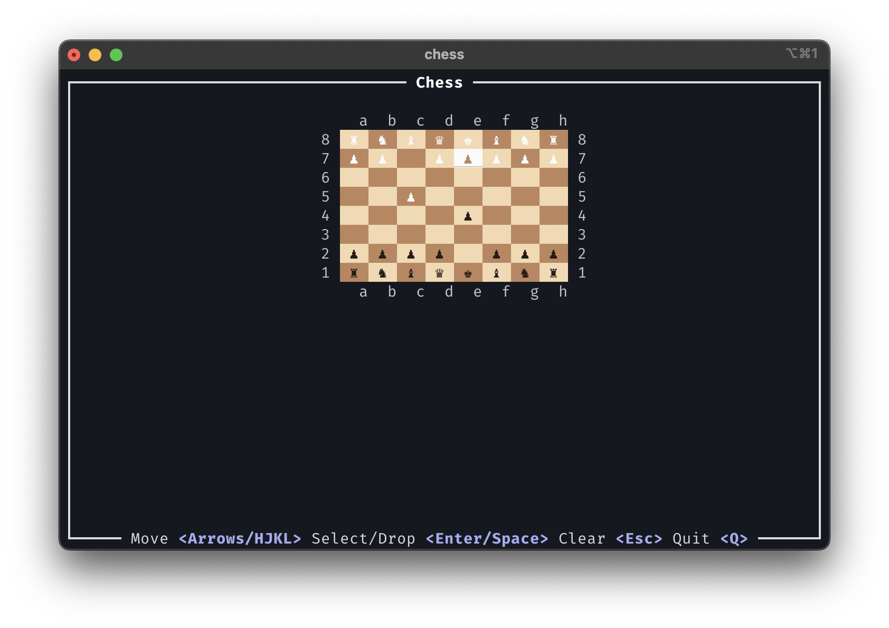

# ♘ chess

It's chess. C'mon, you know what I'm talking about.



## Okay, a few more details

This is an terminal-based, keyboard-controlled chess game.

Happy now?

## Building chess

To build chess, you need the [Rust toolchain](https://rust-lang.org/learn/get-started/).

Build it like so:

``` sh
cargo build --release
```

Run and play it immediately in your shell:

``` sh
cargo run
```
